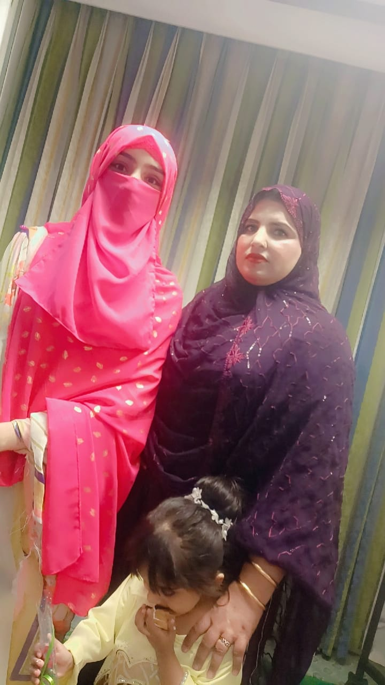

# Happy_Birthday_World_Best_Mom
🎀 Mom’s Birthday Website — A Heartfelt Digital Surprise  This project is a beautifully designed, interactive birthday website created as a heartfelt gift for my mother. It combines soft, dreamy aesthetics with emotional animations, cute bear illustrations, glitter effects, and a warm message that reflects love, gratitude, and appreciation.
<html lang="en">
<head>
<meta charset="utf-8" />
<meta name="viewport" content="width=device-width,initial-scale=1.0" />
<title>Happy Birthday — World's Best Mom 💖</title>

<link href="https://fonts.googleapis.com/css2?family=Playfair+Display:wght@400;700&family=Poppins:wght@300;400;600&display=swap" rel="stylesheet">

</head>

<body>

  

  

  

    <header class="hero">
      

        <!-- 
          *** 1. VIDEO FILE PATH ***
          Replace 'YOUR_VIDEO_FILE_NAME.mp4' with the exact name of your video file (e.g., 'mom_video.mp4')
          Make sure the file is in the same folder as this HTML file!
        -->
        <video id="heroVideo" autoplay muted playsinline loop>
          <source src="YOUR_VIDEO_FILE_NAME.mp4" type="video/mp4"> 
          Your browser does not support the video tag.
        </video>
      

      

        <h1 id="headline" data-animate>Happy Birthday World's Best Mom 🤍</h1>
        
A heartfelt website built just for you, filled with love, memories, and big promises for the future.

        

          <button class="btn" id="playBtn" title="Play/Pause music">Play Music ♪</button>
          <button class="small" id="revealBtn">Your Special Message 💌</button>
        

      

    </header>

    <section>
      
Our Journey Together

      

        

          <h3>The Beginning 🤍</h3>
          
The first look, the first lesson, and the foundation of our unbreakable bond.

        

        

          <h3>Your Strength, My Guide 🌹</h3>
          
You taught me kindness, resilience, and how to chase dreams with all my heart.

        

        

          <h3>Laughter & Memories 💫</h3>
          
Every small trip and every quiet moment at home is a treasure I hold close.

        

        

        <h3>The Future We Share 💖</h3>
            
Looking forward to many more years of love, joy, and new adventures with you.

          

      

    </section>

    <section>
      
Our Precious Memories Gallery

      

        

          <!-- 
            *** 2. GALLERY IMAGE FILE PATHS ***
          -->
          

          

          

          

          

          

        

        

      

    </section>

    <section>
      
A Note Written Just For You

      

        <h3 style="margin:0 0 8px 0; color:var(--accent); font-family:var(--font-head);">My Heartfelt Promise</h3>
        

          𝑯𝒂𝒑𝒑𝒚 𝒃𝒊𝒓𝒕𝒉𝒅𝒂𝒚 𝑴𝒐𝒎 ✦♥︎‿♥︎✦💗🥳💋😘
          
          ┈┈ ☆☆☆☆☆☆☆┈
          ┈┈╭┻┻┻┻┻┻┻┻┻╮┈┈
          ┈┈┃╱╲╱╲╱╲╱╲╱┃┈┈
          ┈╭┻━━━━━━━━━┻╮┈
          ┈┃╱╲╱╲╱╲╱╲╱╲╱┃┈
          ┈┗━━━━━━━━━━━┛┈
          
          𝑾𝒊𝒔𝒉𝒊𝒏𝒈 𝒚𝒐𝒖 𝒂 𝑴𝒂𝒏𝒚 𝒎𝒂𝒏𝒚 𝒉𝒂𝒑𝒑𝒚 𝒓𝒆𝒕𝒖𝒓𝒏𝒔 𝒐𝒇 𝒕𝒉𝒆 𝒅𝒂𝒚 𝒎𝒚 𝒃𝒆𝒂𝒖𝒕𝒊𝒇𝒖𝒍 𝑴𝒐𝒎 🎂👑💕
          𝒀𝒐𝒖 𝒂𝒓𝒆 𝒏𝒐𝒕 𝒋𝒖𝒔𝒕 𝒎𝒚 𝑴𝒐𝒎, 𝒚𝒐𝒖 𝒂𝒓𝒆 𝒎𝒚 𝒉𝒆𝒂𝒓𝒕, 𝒎𝒚 𝒔𝒉𝒂𝒅𝒐𝒘, 𝒎𝒚 𝒔𝒎𝒊𝒍𝒆 ✨💞
          𝑻𝒐𝒅𝒂𝒚 𝒊𝒔 𝒂𝒍𝒍 𝒚𝒐𝒖𝒓𝒔 🎉💝 𝑴𝒂𝒚 𝒀𝒐𝒖𝒓 𝒍𝒊𝒇𝒆 𝒇𝒊𝒍𝒍 𝒘𝒊𝒕𝒉 𝒍𝒐𝒗𝒆, 𝒔𝒖𝒄𝒄𝒆𝒔𝒔, 𝒉𝒂𝒑𝒑𝒊𝒏𝒆𝒔𝒔 & 𝒏𝒆𝒗𝒆𝒓-𝒆𝒏𝒅𝒊𝒏𝒈 𝒔𝒎𝒊𝒍𝒆𝒔 🌹💫
          🇲‌🇦‌🇷‌🇮 ρүɑяⅈ Ꮇ𖽒Ꮇ 👑🌸 𝗸𝗼 𝗷𝗮𝗻𝗺𝗱𝗶 𝗸𝗶 𝗯𝗼𝗵𝗼𝘁 𝗯𝗼𝗵𝗼𝘁 𝗺𝘂𝗯𝗮𝗿𝗮𝗸𝗯𝗮𝗱 🎂🎉💜
          🌸 𝗮𝗹𝗹𝗮𝗵 𝗮𝗽𝗸𝗶 𝘇𝗶𝗻𝗱𝗮𝗴𝗶 𝗺𝗲 𝗵𝗮𝗿 𝗽𝗮𝗹
          𝗸𝗵𝘂𝘀𝗵𝗶𝗼𝗻 💝 𝗼𝗿 𝗽𝘆𝗮𝗿 💫 𝗯𝗮𝗿𝗸𝗮𝘁𝗲𝗶𝗻 🌹
          𝗯𝗮𝗿𝗮𝗸𝗮𝘁 𝗱𝗲 ✨
          🇵‌🇦‌🇷‌ 𝗺𝗲𝗿𝗶 𝗱𝗼𝘀𝘁, 𝗺𝗲𝗿𝗶 𝗷𝗮𝗻, 𝗺𝗲𝗿𝗶 𝗤𝘂𝗲𝗲𝗻 👑
          𝗵𝗮𝗽𝗽𝘆 𝗯𝗶𝗿𝘁𝗵𝗱𝗮𝘆 🎀🎂💜
          💗💖 𝒀𝒐𝒖 𝒂𝒓𝒆 𝒎𝒚 𝒃𝒆𝒔𝒕 𝒇𝒓𝒊𝒆𝒏𝒅, 𝒎𝒚 𝒔𝒐𝒖𝒍-𝒎𝒂𝒕𝒆, 𝒎𝒚 𝑸𝒖𝒆𝒆𝒏 👑💞
          𝑴𝒂𝒚 𝒕𝒉𝒊𝒔 𝒚𝒆𝒂𝒓 𝒃𝒓𝒊𝒏𝒈 𝒖𝒏𝒍𝒊𝒎𝒊𝒕𝒆𝒅 𝒋𝒐𝒚 🎁🎊
          𝑯𝒂𝒑𝒑𝒚 𝑩𝒊𝒓𝒕𝒉𝒅𝒂𝒚 𝒎𝒚 𝒃𝒆𝒔𝒕𝒆𝒔𝒕 𝑴𝒐𝒎𝒎𝒂 💕🌸
          𝓛𝓸𝓿𝓮 𝔂𝓸𝓾 𝓽𝓸 𝓽𝓱𝓮 𝓶𝓸𝓸𝓷 & 𝓫𝓪𝓬𝓴 🌙💖
          #𝐻𝒶𝓅𝓅𝓎𝐵𝒾𝓇𝓉𝒽𝒹𝒶𝓎𝑀𝑜𝓂 🎀👑🎂💐
          
          ╮╭╭╮┏╮┏╮╮╭
          ┣┫┣┫┣╯┣╯╰┫  ☆
          ╯╯╯╯╯╯╯╯╰╯╭━┻━╮
          ┏╮┊┏╮╭╮╮╭╭┻━━━┻╮
          ┣┫┊┃┃┣┫╰┫┣╮╭╮╭╮┃
          ┗╯┊┗╯╯╯╰╯┃╰╯╰╯╰┫
          ━━━━━━━━━╯╳╳╳╳╳╰
          🖤🤍🖤🤍🖤🤍🖤🤍🖤
          ★🎂 ℋ𝑎𝑝𝑝𝑦 ℬ𝑖𝑟𝑡ℎ𝑑𝑎𝑦 🎂★🍰 ⋆｡˚ ᡣ𐭩𓅫𝐻𝒶𝓅𝓅𝓎 𝒷𝒾𝓇𝓉𝒽𝒹𝒶𝓎★...
          ★·.·´¯`·.·★ 💜🎂💫
          ｍɑ𝔯ⅈ ρүɑяⅈ Ꮇ𖽒Ꮇ 👑🌸
          𝘬𝗈 ｍɑη𝗒 ｍɑη𝗒 ђɑρρ𝗒 𝗋𝑒𝗍ù𝗋η𝗌 𝗈𝖿 𝗍һ𝑒 ɗɑ𝗒 💜🎀
          
          {♥︎‿♥︎}{♥︎‿♥︎}{♥︎‿♥︎}
          💜 ｍ𝗒 ｌ𝗂ƒ𝑒, ｍ𝗒 ｈ𝗎𝑔, ｍ𝗒 ｓｍ𝗂𝗅𝑒 🌸
          💫 ｍ𝑒𝗋ⅈ 𝚀𝗎𝑒𝖾η ｍ𖽒ｍ, ｈɑρρ𝗂η𝑒ѕѕ ｋɑ ｂußｄｌ𝑒 💝
          💜 ｍɑ𝗒 ｙ𝗈ù𝗋 ｄ𝗋𝑒ɑｍѕ ｆ𝗅𝗈ω ｌ𝗂ｋ𝑒 ｓ𝑡𝑎𝗋ѕ ｉη ｐυ𝑟ρ𝗅𝑒 ｓ𝗄𝗒 ✨🌌
          
          ★·.·´¯·.·★ 🎂 𝐇𝐀𝐏𝐏𝐘 𝐁𝐈𝐑𝐓𝐇𝐃𝐀𝐘 💜★·.·´¯·.·★
          🌸 ｍ𝗒 ｈ𝑒ɑ𝗋𝗍𝗯𝑒ɑ𝑡 𝑴𝒐𝒎 🌸
          
          {♥︎‿♥︎}{♥︎‿♥︎}{♥︎‿♥︎}
          *🌸⃟‌ٖٖٖٖٖٖ❤️*
          *💞⃝⃪⃕ 🌸*
        

      

    </section>

    <section class="ending">
      

        <h2 style="margin:0 0 6px 0; font-family:var(--font-head); color:var(--accent);">I love you, Mom 🤍</h2>
        
You are my home. May your world always be as warm and bright as you make mine.

        

          <button class="btn" id="hugBtn">Tap for a big virtual hug 🤗</button>
        

      

    </section>
        <!-- 
      *** 3. MUSIC FILE PATH: UPDATED ***
    
    -->
    <audio id="bgMusic" loop crossorigin="anonymous">
      <source src="Happy-Birthday-To-You-Ji-Teddy-Kids-Song.mp3" type="audio/mpeg"
    </audio>

  
 

 

  

    <button class="close-btn" id="closeModal">&times;</button>
    

    <!-- 
      *** 4. HUG IMAGE/GIF FILE PATH ***
      I've kept a generic placeholder here for safety. If you want to use your GIF, 
      replace the URL below with the file name (e.g., 'bear_hug.gif').
    -->
 <video id="heroVideo" autoplay muted playsinline loop>
          <source src="YOUR_VIDEO_FILE_NAME 2.mp4" type="video/mp4"> 
        </video>
      
 
      class="hug-image"/>
    <h3 style="color:var(--accent); font-family:var(--font-head);">Sending Big Hugs!</h3>
    
You're the best, Mom! This hug is for you.

  

</body>
</html>
